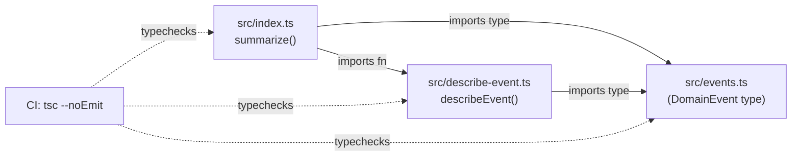

- `events.ts` defines the discriminated union `DomainEvent` (`created` /
  `updated` / `deleted`), each variant with its own required fields.
- `describe-event.ts` exhaustively switches over `event.kind`; the `default`
  branch assigns to a `never`-typed `unreachable` so that adding a new
  `DomainEvent` variant without a matching `case` becomes a compile error.
  This is the exhaustiveness-check idiom used throughout — see
  [[typescript-conventions]].
- `index.ts` is the only consumer, building a hardcoded `recent` array and
  mapping it through `describeEvent`.
- CI (`.github/workflows/ci.yml`) runs `npm install` then `npm test`, which is
  just `tsc --noEmit` (`package.json`) — there is no bundler, linter, or test
  runner in this repo.
